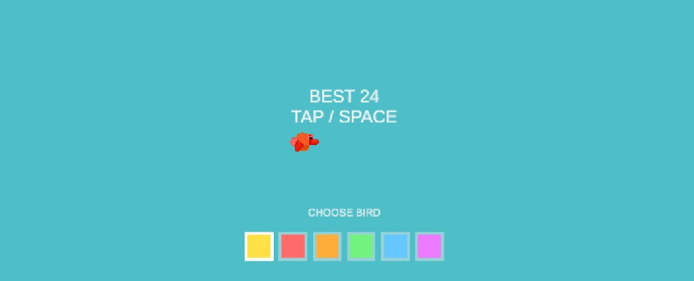
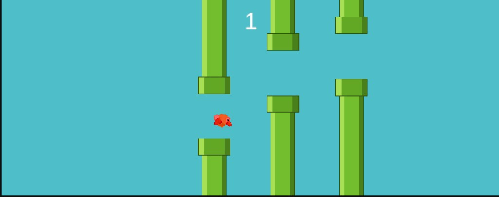
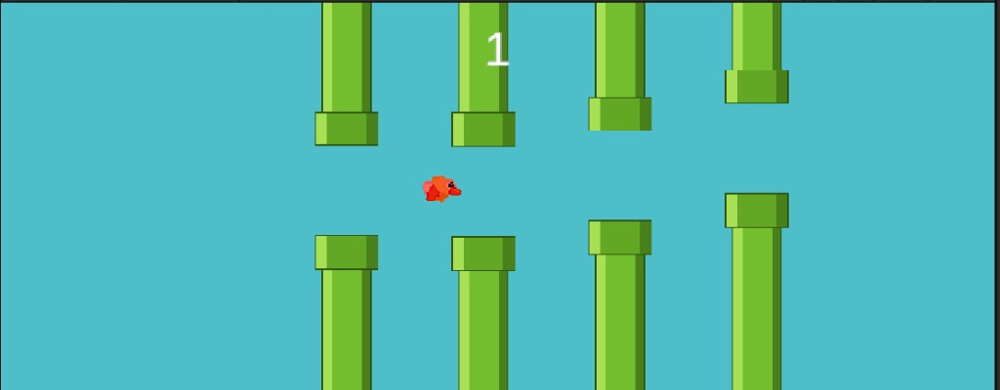
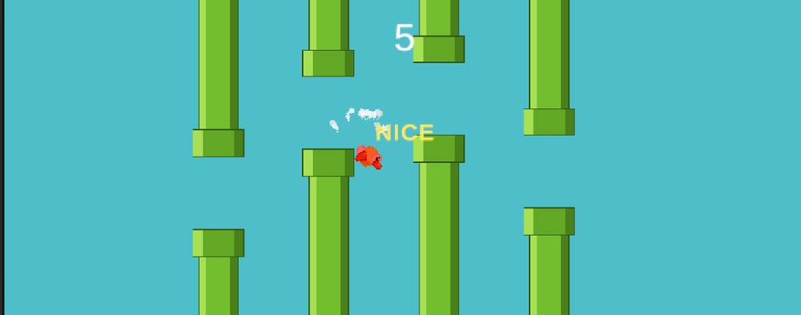
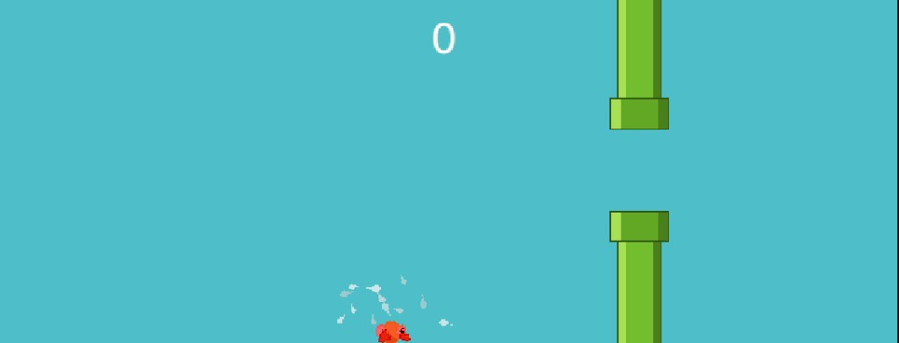

# Flappy Bird: Unity Remake

A complete remake of the classic Flappy Bird arcade game, built from scratch in Unity 6 with the Universal Render Pipeline in 2D mode.

You control a small bird that is constantly pulled down by gravity. Every tap pushes it upward, and the world scrolls past from right to left. Endless pairs of green pipes come toward you, each pair separated by a narrow gap. Steering the bird through a gap scores one point. Touching a pipe or hitting the ground ends the run immediately.

This version adds a bird colour selector, a feather burst on impact, and milestone praise messages that appear as you climb the scoreboard. From score 15 the pace ramps up with much faster scrolling and a decorative rain effect, so late runs stay challenging.

## How to play

| Action | Input |
| --- | --- |
| Start a run | Left mouse click, `Space`, or `Up Arrow` |
| Fly upward | Left mouse click, `Space`, or `Up Arrow` |
| Restart after a crash | Click the **RESTART** button |

The bird never moves horizontally, the world moves instead. Your only control is when to flap, and the entire challenge comes from timing those taps so the bird lines up with the next gap.

## Choosing your bird

Before the first flap, the ready screen shows a CHOOSE BIRD row with six selectable birds. Each option is a different colour: yellow, red, orange, green, light blue and purple, and the currently selected one is marked with a bright white outline.

All six birds are purely cosmetic. They are identical in size, hitbox, weight and flight behaviour, so the choice never makes the game easier or harder.

The bird also gently bobs up and down on this screen, which signals that the game is waiting for your first input rather than already running.

## Core gameplay: flying through the pipes

This is the heart of the game. Pipes arrive in pairs: one hanging from the top of the screen, one rising from the bottom, with a gap between them. The vertical position of that gap is randomised for every pair, so no two runs are the same.

Your objective is to guide the bird cleanly through each gap without touching anything. As shown above, the bird has to thread the narrow opening between the upper and lower pipe.

The run ends the moment the bird touches:

- the body or lip of any pipe,
- the ground at the bottom of the screen, or
- the ceiling at the top of the screen.

The bird also tilts as it moves: it angles upward right after a flap and rotates nose-down as it falls, which gives you a readable visual cue about your current vertical speed.

## The score counter

The large number at the top of the screen is your live score. It counts how many pipe pairs you have successfully passed so far in the current run. In the screenshot above, the bird has cleared one pipe pair, so the counter reads `1`.

A point is awarded the instant the bird passes the horizontal centre of a pipe pair, and a short chime plays to confirm it. When the run ends, the game over panel shows your final score next to your all-time BEST score. If you beat your previous record, the new value is saved automatically and will still be there the next time you launch the game.

## Milestone cheers

Every 5 points, a praise message pops up on screen to celebrate your progress and keep you pushing for one more pipe. The message scales up, drifts upward and fades out, so it never blocks your view of the next gap.

The wording gets stronger the further you get:

| Score reached | Message |
| --- | --- |
| 5 | **NICE** |
| 10 | **WOW** |
| 15 | **EPIC** |
| 20 | **LEGENDARY** |
| 25 | **UNSTOPPABLE** |
| 30 | **GODLIKE** |
| 40+ | **MYTHIC** |

Each tier also has its own colour, so the message becomes visibly more impressive as your score climbs. From 10 points onward, the cheer is accompanied by a firework burst around the bird.

## Hard mode from score 15

To keep strong players challenged, the game ramps up once you reach **15** points. From that score onward the world scrolls much faster, so pipes, ground and sky all rush toward you at a higher pace and you have less time to line up each gap.

At the same moment a soft rain effect starts falling from the top of the screen. The rain is only decoration. It does not hurt the bird or change the hitboxes. It is a visual cue that the harder stretch of the run has begun, and it stops when the run ends.

## Crashing: the feather burst

When the bird hits a pipe or the ground, it does not simply stop. A cloud of small feathers bursts out of the point of impact, as shown above. Twelve feathers scatter outward, spin, flutter sideways as they fall under gravity, and fade out.

The feathers are tinted to match the bird colour you selected, so a green bird loses green feathers. The effect gives the crash a satisfying, readable moment of impact instead of an abrupt freeze.

At the same time the pipes stop scrolling, a crash sound plays, and the bird drops out of the sky. After a short delay the game over panel appears with your score, your best score, an earned medal, and the RESTART button.
